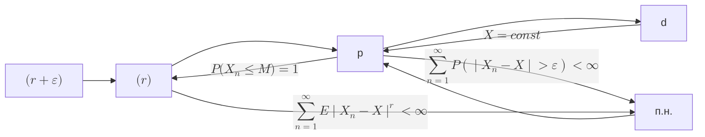

# тервер-для задач

# Формула полной вероятности

$B \subset \bigcup{A_n}$

$$
P(B) = \sum{P(A_n) P(B \mid A_n)}
$$

# Формула Байеса

$B \subset \bigcup{A_n}$

$$
P(A_k \mid B) = \frac{P(B \mid A_k) P(A_k)}{\sum{P(A_k) P(B \mid A_k)}}
$$

# Формула включений-исключений

$$
P \group{\bigcup_{k = 1}^{n}{A_k}} = \sum_{k = 1}^{n}{(-1)^{k+1} \sum_{1 \le i_1 < \dots < i_k \le n}{P(A_{i_1} \cdot \ldots \cdot A_{i_k})}}
$$

# Математическое ожидание

$$
E \xi \defeq \int_{\Omega}{\xi(\omega) P(\d \omega)}
$$

## Свойства математического ожидания

1. $E(\xi \equiv c) = c$
2. $E(\alpha \xi) = \alpha E(\xi)$
3. $E(\xi_1 + \xi_2) = E(\xi_1) + E(\xi_2)$
4. $\xi = \eta\ (\textit{почти наверное - п.н. - P почти всюду})
\implies E(\xi) = E(\eta)$
5. $\xi \le \eta\ (п.н.) \implies E(\xi) \le E(\eta)$
6. $\xi \ge 0\ (п.н.),\quad E(\xi) \ge 0 \implies \xi = 0\ (п.н.)$

# Дисперсия

$D_\xi = \sigma^2 \defeq E \groupr{\group{\xi - E \xi}^2}$

## Свойства дисперсии

1. $D_\xi = E_{\xi^2} - (E_\xi)^2$
2. $D_{a\xi + b} = a^2 D_\xi$
3. $D_\xi = 0 \same \xi \equiv const$
4. $D_{\xi + \eta} = 
E\group{\mathring{\xi} + \mathring{\eta}}^2 = 
D_\xi + D_\eta + 2 E_{\mathring{\xi}\mathring{\eta}} = 
D_\xi + D_\eta + cov\group{\xi, \eta}$

# Ковариация

$$
cov(\xi, \eta) \defeq E_{\mathring{\xi}\mathring{\eta}}
$$

## Свойства ковариации

1. $cov(\xi, \eta) = E_{\xi\eta} - E_\xi E_\eta$
2. $cov(\xi, \xi) = D_\xi$
3. $\eta = a\xi + b \implies cov(\xi,\eta) = a D_\xi$

# Характеристическая функция

$$
\varphi_\xi(t) \defeq E e^{it \xi} = \int_{\RR}{e^{itx} \d F_\xi(x)}
$$

## Свойства характеристической функции

1. $$
   \abs{\varphi_\xi(t)} \le 1, \quad \varphi_\xi(0) = 1
   $$
2. Равномерная непрерывность
3. $\xi,\mu$ - НСВ $\implies$

   $$
      \varphi*{\xi + \mu}(t) = \varphi*\xi(t) \varphi\_\mu(t)
   $$

4. $$
   \varphi_{a \xi + b}(t) = e^{itb} \varphi_\xi(at)
   $$
5. $$
   \dv[k]{t}{} \varphi_\xi(0) = (i)^k E\groupr{\xi^k}
   $$

# Сходимости

$$
\Array{|l|l|}{
\hline
X_n \xra{d} X &
F_{X_n} \xra{п.в.} F_X \\
\hline
X_n \xra{p} X &
\forall \varepsilon \hthen P(\abs{X_n - X} > \varepsilon) \to 0 \\
\hline
X_n \xra{п.н.} X &
P(\omega: X_n(\omega) \to X(\omega)) = 1 \\
\hline
X_n \xra{(r)} X &
E \group{\abs{X_n - X}^r} \to 0 \\
\hline
}
$$

## Критерий сходимости почти наверное

$$
X_n \xra{п.н.} X \same
\groupr{\forall \varepsilon \hthen P(\sup_{k \ge n}\abs{X_k - X} > \varepsilon) \to 0, \quad n \to \infty} \\
$$

## Теорема Рисса

$$
X_n \xra{p} X \implies \exists \set{n_k} : X_{n_k} \xra{п.н.} X
$$

## Сходимость моментов

$$
X_n \xra{(n)} X \implies E^{[k]} X_n \to E^{[k]} X \quad \forall k \le n
$$

## Свойство наследования сходимости

$$
\Gather{
X_n \xra{п.н.} X \implies g(X_n) \xra{п.н.} g(X) \\
X_n \xra{p} X \implies g(X_n) \xra{p} g(X) \\
X_n \xra{(r)} X \centernot\implies g(X_n) \xra{(r)} g(X) \\
}
$$

## Теорема Слуцкого

$f: \RR^2 \to \RR \in C$

$$
\left.\Align{
\xi_n \xra{d} \xi \\
\eta_n \xra{p} c
}\right\} \implies f(\xi_n, \eta_n) \xra{d} f(\xi, c)
$$

# Lemma. Бореля-Кантелли

## If:

$$
A = \bigcap_{m \in \NN}{\bigcup_{n \ge m}{A_n}}
$$

## Then:

1. $\sum{P(A_n)} < \infty \implies P(A) = 0$
2. $\sum{P(A_n)} = \infty \land \set{A_n} \dash \text{\textit{совместно независимы}} \implies P(B) = 1$

# Неравенство Гельдера

$$
E_{\abs{\xi\eta}} \le \group{E_{\abs{\xi}^p}}^\frac{1}{p} \group{E_{\abs{\eta}^q}}^\frac{1}{q}
$$

# Неравенство КБШ

$$
\group{E_{\abs{\xi + \eta}^p}}^\frac{1}{p} \le
\group{E_{\abs{\xi}^p}}^\frac{1}{p} + \group{E_{\abs{\eta}^p}}^\frac{1}{p}
$$

# Неравенство Ляпунова

$$
\group{E_{\abs{\xi + \eta}^p}}^\frac{1}{p} \ge
\group{E_{\abs{\xi}^q}}^\frac{1}{q},\quad
p > q > 0
$$

# Неравенство Йенсена

$g$ выпукла вниз

$$
E g(\xi) \ge g(E \xi)
$$

