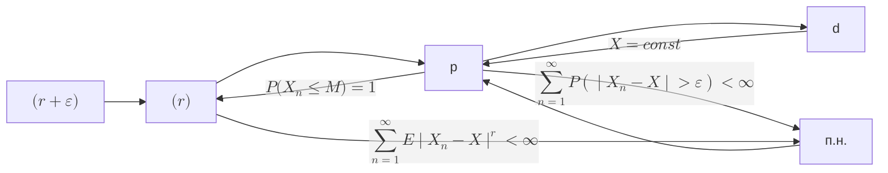

# тервер-для задач

# Распределения

## Бернулли $Be(p)$

$$
P(X = 1) = p, \quad P(X = 0) = q = 1 - p
$$

$$
\Gather{
E\groupr{Be(p)} = p \\
D\groupr{Be(p)} = p q \\
}
$$

$$
\varphi\groupr{Be(p)}(t) = q + p e^{it}
$$

## Биномиальное $Binom(p,n)$

$$
P(X = k) = C_n^k p^k q^{n-k}
$$

$$
\Gather{
E\groupr{Bi(n,p)} = n p \\
D\groupr{Bi(n,p)} = n p q \\
}
$$

$$
\varphi\groupr{Bi(p,n)}(t) = \group{q + p e^{it}}^n
$$

$$
Bi(p,n) = \sum_{k=1}^{n}{Be(p)}
$$

$$
Bi(p,n) \to Poiss(np), \quad \lambda = np \to \infty
$$

## Пуассон $Poiss(\lambda)$

$$
P(X = k) = \frac{\lambda^k}{k!} e^{-\lambda}
$$

$$
\Gather{
E\groupr{Poiss(\lambda)} = \lambda \\
D\groupr{Poiss(\lambda)} = \lambda \\
}
$$

$$
\varphi\groupr{Poiss(\lambda)}(t) = e^{\lambda (e^{it} - 1)}
$$

$$
\sum{Poiss(\lambda_i)} = Poiss(\sum{\lambda_i})
$$

$$
Poiss(\lambda) \to \mcN(\lambda, \lambda), \quad \lambda \to \infty
$$

## Равномерное $U(a,b)$

$$
\varphi_{U(a,b)}(t) = \frac{e^{itb} - e^{ita}}{it(b-a)}
$$

$$
\Gather{
E\groupr{U(a,b)} = \frac{a + b}{2} \\
D\groupr{U(a,b)} = \frac{(b - a)^2}{12}
}
$$

$$
\varphi_{U(a,b)}(t) = \frac{e^{itb} - e^{ita}}{it(b-a)}
$$

$$
\varphi_{U(-1,1)}(t) = \frac{\sin t}{t}
$$

## Нормальное $\mcN(m, \sigma^2)$

$$
\Gather{
\mcN(m, \sigma^2) = \sigma \mcN(0,1) + m \\
\sum{\mcN(m_i, \sigma_i^2)} = \mcN(\sum{m_i}, \sum{\sigma_i^2}) \\
}
$$

$$
\varphi\groupr{\mcN(m, \sigma^2)}(t) = e^{itm} e^{-\frac{t^2 \sigma^2}{2}}
$$

## Гамма-распределение $Gamma(\alpha, \lambda)$

$$
f \groupr{Gamma(\alpha, \lambda)}(x) = \frac{\lambda^\alpha}{\Gamma(\alpha)} x^{\alpha - 1} e^{-\lambda x}
$$

## Показательное $Exp(\lambda)$

$$
Exp(\lambda) \defeq Gamma(1, \lambda)
$$

$$
\Gather{
f \groupr{Exp(\lambda)}(x) = \lambda e^{-\lambda x} \\
F \groupr{Exp(\lambda)}(x) = 1 - e^{-\lambda x} \\
}
$$

$$
\Gather{
E^{[k]}\groupr{Exp(\lambda)} = \frac{k!}{\lambda^k} \\
E\groupr{Exp(\lambda)} = \frac{1}{\lambda} \\
D\groupr{Exp(\lambda)} = \frac{1}{\lambda^2}
}
$$

$$
\varphi\groupr{Exp(\lambda)}(t) = \group{1 - \frac{it}{\lambda}}\inv
$$

$$
Exp(\frac{1}{2}) = \chi^2(2)
$$

$$
\min\group{Exp(\lambda_i)} = Exp\group{\sum{\lambda_i}}
$$

## Бета-распределение $Beta(\alpha, \beta)$

$$
f \groupr{Beta(\alpha, \beta)}(x) = \frac{\Gamma(\alpha + \beta)}{\Gamma(\alpha)\Gamma(\beta)} x^{\alpha - 1} (1 - x)^{\beta - 1}
$$

$$
\Gather{
E\groupr{Beta(\alpha, \beta)} = \frac{\alpha}{\alpha + \beta} \\
D\groupr{Beta(\alpha, \beta)} = \frac{\alpha \beta}{(\alpha + \beta)^2 (\alpha + \beta + 1)}
}
$$

## Коши $\mcK(a, \sigma)$

$$
f \groupr{\mcK(m,\sigma)}(x) = \frac{1}{\pi \sigma \group{1 + \frac{(x - m)^2}{\sigma^2}}}
$$

$$
\Gather{
\not\exists E\groupr{K(m,\sigma)} \\
\not\exists D\groupr{K(m,\sigma)}
}
$$

$$
\sum{K(m_i, \sigma_i^2)} = K(\sum{m_i}, \sum{\sigma_i^2}) \\
$$

$$
\varphi\groupr{\mcK(m,\sigma^2)}(t) = e^{-\abs{t}}
$$

## Таблица хар. ф-ий

| $\varphi_\xi(t)$                      | $\xi$                                    |
| ------------------------------------- | ---------------------------------------- |
| $1$                                   | $\xi \equiv 0$                           |
| $e^{itc}$                             | $\xi \equiv c$                           |
| $q + pe^{it}$                         | $Be(p)$                                  |
| $(q + p e^{it})^n$                    | $Binom(n,p)$                             |
| $e^{itm} e^{-\frac{t^2 \sigma^2}{2}}$ | $\mcN(m, \sigma^2)$                      |
| $\frac{e^{itb} - e^{ita}}{it(b-a)}$   | $U(a,b)$                                 |
| $\frac{\sin t}{t}$                    | $U(-1,1)$                                |
| $\cos{t}$                             | $P(\xi = 1) = P(\xi = -1) = \frac{1}{2}$ |
| $e^{-\abs{t}}$                        | $K(m,\sigma^2)$                          |

# Теоремы

# Формула полной вероятности

$B \subset \bigcup{A_n}$

$$
P(B) = \sum{P(A_n) P(B \mid A_n)}
$$

# Формула Байеса

$B \subset \bigcup{A_n}$

$$
P(A_k \mid B) = \frac{P(B \mid A_k) P(A_k)}{\sum{P(A_k) P(B \mid A_k)}}
$$

# Формула включений-исключений

$$
P \group{\bigcup_{k = 1}^{n}{A_k}} = \sum_{k = 1}^{n}{(-1)^{k+1} \sum_{1 \le i_1 < \dots < i_k \le n}{P(A_{i_1} \cdot \ldots \cdot A_{i_k})}}
$$

# Математическое ожидание

$$
E \xi \defeq \int_{\Omega}{\xi(\omega) P(\d \omega)}
$$

## Свойства математического ожидания

1. $E(\xi \equiv c) = c$
2. $E(\alpha \xi) = \alpha E(\xi)$
3. $E(\xi_1 + \xi_2) = E(\xi_1) + E(\xi_2)$
4. $\xi = \eta\ (\textit{почти наверное - п.н. - P почти всюду})
\implies E(\xi) = E(\eta)$
5. $\xi \le \eta\ (п.н.) \implies E(\xi) \le E(\eta)$
6. $\xi \ge 0\ (п.н.),\quad E(\xi) \ge 0 \implies \xi = 0\ (п.н.)$

# Дисперсия

$D_\xi = \sigma^2 \defeq E \groupr{\group{\xi - E \xi}^2}$

## Свойства дисперсии

1. $D_\xi = E_{\xi^2} - (E_\xi)^2$
2. $D_{a\xi + b} = a^2 D_\xi$
3. $D_\xi = 0 \same \xi \equiv const$
4. $D_{\xi + \eta} = 
E\group{\mathring{\xi} + \mathring{\eta}}^2 = 
D_\xi + D_\eta + 2 E_{\mathring{\xi}\mathring{\eta}} = 
D_\xi + D_\eta + cov\group{\xi, \eta}$

# Ковариация

$$
cov(\xi, \eta) \defeq E_{\mathring{\xi}\mathring{\eta}}
$$

## Свойства ковариации

1. $cov(\xi, \eta) = E_{\xi\eta} - E_\xi E_\eta$
2. $cov(\xi, \xi) = D_\xi$
3. $\eta = a\xi + b \implies cov(\xi,\eta) = a D_\xi$

# Характеристическая функция

$$
\varphi_\xi(t) \defeq E e^{it \xi} = \int_{\RR}{e^{itx} \d F_\xi(x)}
$$

## Свойства характеристической функции

1. $$
   \abs{\varphi_\xi(t)} \le 1, \quad \varphi_\xi(0) = 1
   $$
2. Равномерная непрерывность
3. $\xi,\mu$ - НСВ $\implies$

   $$
      \varphi*{\xi + \mu}(t) = \varphi*\xi(t) \varphi\_\mu(t)
   $$

4. $$
   \varphi_{a \xi + b}(t) = e^{itb} \varphi_\xi(at)
   $$
5. $$
   \dv[k]{t}{} \varphi_\xi(0) = (i)^k E\groupr{\xi^k}
   $$

# Сходимости

$$
\Array{|l|l|}{
\hline
X_n \xra{d} X &
F_{X_n} \xra{п.в.} F_X \\
\hline
X_n \xra{p} X &
\forall \varepsilon \hthen P(\abs{X_n - X} > \varepsilon) \to 0 \\
\hline
X_n \xra{п.н.} X &
P(\omega: X_n(\omega) \to X(\omega)) = 1 \\
\hline
X_n \xra{(r)} X &
E \group{\abs{X_n - X}^r} \to 0 \\
\hline
}
$$

## Критерий сходимости почти наверное

$$
X_n \xra{п.н.} X \same
\groupr{\forall \varepsilon \hthen P(\sup_{k \ge n}\abs{X_k - X} > \varepsilon) \to 0, \quad n \to \infty} \\
$$

## Теорема Рисса

$$
X_n \xra{p} X \implies \exists \set{n_k} : X_{n_k} \xra{п.н.} X
$$

## Сходимость моментов

$$
X_n \xra{(n)} X \implies E^{[k]} X_n \to E^{[k]} X \quad \forall k \le n
$$

## Свойство наследования сходимости

$$
\Gather{
X_n \xra{п.н.} X \implies g(X_n) \xra{п.н.} g(X) \\
X_n \xra{p} X \implies g(X_n) \xra{p} g(X) \\
X_n \xra{(r)} X \centernot\implies g(X_n) \xra{(r)} g(X) \\
}
$$

## Теорема Слуцкого

$f: \RR^2 \to \RR \in C$

$$
\left.\Align{
\xi_n \xra{d} \xi \\
\eta_n \xra{p} c
}\right\} \implies f(\xi_n, \eta_n) \xra{d} f(\xi, c)
$$

# Lemma. Бореля-Кантелли

## If:

$$
A = \bigcap_{m \in \NN}{\bigcup_{n \ge m}{A_n}}
$$

## Then:

1. $\sum{P(A_n)} < \infty \implies P(A) = 0$
2. $\sum{P(A_n)} = \infty \land \set{A_n} \dash \text{\textit{совместно независимы}} \implies P(B) = 1$

# Неравенство Гельдера

$$
E_{\abs{\xi\eta}} \le \group{E_{\abs{\xi}^p}}^\frac{1}{p} \group{E_{\abs{\eta}^q}}^\frac{1}{q}
$$

# Неравенство КБШ

$$
\group{E_{\abs{\xi + \eta}^p}}^\frac{1}{p} \le
\group{E_{\abs{\xi}^p}}^\frac{1}{p} + \group{E_{\abs{\eta}^p}}^\frac{1}{p}
$$

# Неравенство Ляпунова

$$
\group{E_{\abs{\xi + \eta}^p}}^\frac{1}{p} \ge
\group{E_{\abs{\xi}^q}}^\frac{1}{q},\quad
p > q > 0
$$

# Неравенство Йенсена

$g$ выпукла вниз

$$
E g(\xi) \ge g(E \xi)
$$

$$
\Array{|l|l|}{
\hline
\text{\textit{Неравенство Гельдера}} &
E_{\abs{\xi \eta}} \le \left( E_{\abs{\xi}^p} \right)^{\frac{1}{p}} \left( E_{\abs{\eta}^q} \right)^{\frac{1}{q}} \\
\hline
\text{\textit{Неравенство КБШ (Коши-Буняковского-Шварца)}} &
\left( E_{\abs{\xi + \eta}^p} \right)^{\frac{1}{p}} \le
\left( E_{\abs{\xi}^p} \right)^{\frac{1}{p}} + \left( E_{\abs{\eta}^p} \right)^{\frac{1}{p}} \\
\hline
\text{\textit{Неравенство Ляпунова}} &
\left( E_{\abs{\xi + \eta}^p} \right)^{\frac{1}{p}} \ge
\left( E_{\abs{\xi}^q} \right)^{\frac{1}{q}}, \quad p > q > 0 \\
\hline
\text{\textit{Неравенство Йенсена}} &
\text{Если } g \text{ выпукла вниз}, \\
& E g(\xi) \ge g(E \xi) \\
\hline
}
$$

# Критерий ЗБЧ. Теорема Колмогорова.

$$
\Gather{
E \group{\frac{\group{\ol{\mathring{\xi_n}}}^2}{1 + \group{\ol{\mathring{\xi_n}}}^2}}
\xrightarrow{n\to\infty} 0 \\
\same \\
ЗБЧ
}
$$

Замечание: "2" можно заменить на $\alpha > 0$.

$\set{\xi_n} - НСВ \implies$

$$
\Gather{
\sum_{k=1}^n E\group{\frac{\group{\mathring{\xi_k}}^2}{n^2 + \group{\mathring{\xi_k}}^2}}
\to 0 \\
\same \\
ЗБЧ
}
$$

# Достаточные условия ЗБЧ

## Теорема Маркова.

$$
\frac{1}{n^2} D\group{\sum_{k=1}^n \xi_k} \xrightarrow{n\to\infty} 0 \implies ЗБЧ
$$

## Теорема Хинчина.

$$
\Cases{
\set{\xi_n} - НОРСВ \\
E \xi_n < \infty
} \implies ЗБЧ
$$

## Теорема Чебышева.

$$
\Cases{
\cov{\xi_i}{\xi_j} = 0, \quad i \ne j \\
D \xi_n \le c \cdot n^\alpha, \quad \alpha \in [0,1)
} \implies ЗБЧ
$$

# Первая теорема Колмогорова

$$
\Cases{
\set{\xi_m} \dash НСВ \\
\sum{\frac{D \xi_n}{n^2}} < \infty \\
} \implies
\ol{\mathring{\xi_n}} \xra{п.н.} 0
$$

# Вторая теорема Колмогорова

$\set{\xi_n}$ - НОРСВ

$$
\ol{\xi_n} - a \xra{п.н.} 0 \same E \xi = a
$$

# Теорема Пуассона

$n p_n \to \lambda, \quad n \to \infty$

$$
Bi(p_n, n) \xra{d} Poiss(\lambda)
$$

# Условие Линдберга

$\set{\eta_{nk}}_{k=1}^{n}$
$E \eta_{nk} = 0$
$\sum_{k=1}^{n}{D \eta_{nk}} = 1$

$$
\forall \varepsilon \hthen
\groupr{\sum_{k = 1}^{n}{\int_{\abs{x} > \varepsilon}{x^2 \d F_{nk}(x)}}}
\to 0, \quad n \to \infty
$$

$\implies$

$$
\sum_{k = 1}^{n}{\eta_{nk}} \xra{d} \mcN(0,1)
$$

# Центральная Предельная Теорема (ЦПТ)

$$
\CasesR{
\set{\xi_n} \dash НОРСВ \\
D \xi < \infty
} \implies
\frac{1}{\sqrt{n D \xi}} \sum_{k = 1}^{n}{(\xi_k - E \xi)}
\xra{d} \mcN(0, 1)
$$
