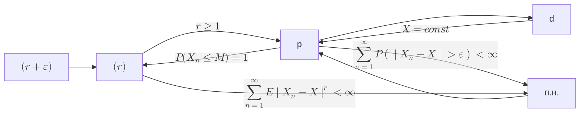

# probability theory summary

# Определения

## Математическое ожидание

$$
E \xi \defeq \int_{\Omega}{\xi(\omega) P(\d \omega)}
$$

### Свойства математического ожидания

1. $E(\xi \equiv c) = c$
2. $E(\alpha \xi) = \alpha E(\xi)$
3. $E(\xi_1 + \xi_2) = E(\xi_1) + E(\xi_2)$
4. $\xi = \eta\ (\textit{почти наверное - п.н. - P почти всюду})
\implies E(\xi) = E(\eta)$
5. $\xi \le \eta\ (п.н.) \implies E(\xi) \le E(\eta)$
6. $\xi \ge 0\ (п.н.),\quad E(\xi) \ge 0 \implies \xi = 0\ (п.н.)$

## Дисперсия

$D_\xi = \sigma^2 \defeq E \groupr{\group{\xi - E \xi}^2}$

### Свойства дисперсии

1. $D_\xi = E_{\xi^2} - (E_\xi)^2$
2. $D_{a\xi + b} = a^2 D_\xi$
3. $D_\xi = 0 \same \xi \equiv const$
4. $D_{\xi + \eta} = 
E\group{\mathring{\xi} + \mathring{\eta}}^2 = 
D_\xi + D_\eta + 2 E_{\mathring{\xi}\mathring{\eta}} = 
D_\xi + D_\eta + cov\group{\xi, \eta}$

## Ковариация

$$
cov(\xi, \eta) \defeq E_{\mathring{\xi}\mathring{\eta}}
$$

### Свойства ковариации

1. $cov(\xi, \eta) = E_{\xi\eta} - E_\xi E_\eta$
2. $cov(\xi, \xi) = D_\xi$
3. $\eta = a\xi + b \implies cov(\xi,\eta) = a D_\xi$

## Характеристическая функция

$$
\varphi_\xi(t) \defeq E e^{it \xi} = \int_{\RR}{e^{itx} \d F_\xi(x)}
$$

### Свойства характеристической функции

1. $$
   \abs{\varphi_\xi(t)} \le 1, \quad \varphi_\xi(0) = 1
   $$
2. Равномерная непрерывность
3. $\xi,\mu$ - НСВ $\implies$

   $$
      \varphi*{\xi + \mu}(t) = \varphi*\xi(t) \varphi\_\mu(t)
   $$

4. $$
   \varphi_{a \xi + b}(t) = e^{itb} \varphi_\xi(at)
   $$
5. $$
   \dv[k]{t}{} \varphi_\xi(0) = (i)^k E\groupr{\xi^k}
   $$

## Условное математическое ожидание

$$
E_{\xi \mid \mu}(x \mid y) \defeq \int{x \d F_{\xi \mid \mu}(x \mid y)}
$$

$$
E_{\xi} = E_\eta\group{E(\xi \mid \eta)}
$$

## Нормированная случайная величина

$$
\eta \defeq \frac{\xi - E \xi}{\sqrt{D \xi}}
$$

$$
\boxed{\Gather{
E \eta = 0 \\
D \eta = 1
}}
$$

## Сходимость

$$
\Array{|l|l|}{
\hline
X_n \xra{d} X &
F_{X_n} \xra{п.в.} F_X \\
\hline
X_n \xra{p} X &
\forall \varepsilon \hthen P(\abs{X_n - X} > \varepsilon) \to 0 \\
\hline
X_n \xra{п.н.} X &
P(\omega: X_n(\omega) \to X(\omega)) = 1 \\
\hline
X_n \xra{(r)} X &
E \group{\abs{X_n - X}^r} \to 0 \\
\hline
}
$$

### Критерий сходимости почти наверное

$$
X_n \xra{п.н.} X \same
\groupr{\forall \varepsilon \hthen P(\sup_{k \ge n}\abs{X_k - X} > \varepsilon) \to 0, \quad n \to \infty} \\
$$

### Теорема Рисса

$$
X_n \xra{p} X \implies \exists \set{n_k} : X_{n_k} \xra{п.н.} X
$$

<!--
### Утв. б.д. для понимания

$$
X_n \xra{d} X \same \forall f \in C(\RR): \exists M : f \le M \hthen E f(X_n) \to E f(X)
$$

-->

### Сходимость моментов

$$
X_n \xra{(n)} X \implies E^{[k]} X_n \to E^{[k]} X \quad \forall k \le n
$$

### Свойство наследования сходимости

$$
\Gather{
X_n \xra{п.н.} X \implies g(X_n) \xra{п.н.} g(X) \\
X_n \xra{p} X \implies g(X_n) \xra{p} g(X) \\
X_n \xra{(r)} X \centernot\implies g(X_n) \xra{(r)} g(X) \\
}
$$

# Теоремы

## Lemma. Бореля-Кантелли

### If:

$$
A = \bigcap_{m \in \NN}{\bigcup_{n \ge m}{A_n}}
$$

### Then:

1. $\sum{P(A_n)} < \infty \implies P(A) = 0$
2. $\sum{P(A_n)} = \infty \land \set{A_n} \dash \text{\textit{совместно независимы}} \implies P(B) = 1$

## Неравенство Гельдера

$$
E_{\abs{\xi\eta}} \le \group{E_{\abs{\xi}^p}}^\frac{1}{p} \group{E_{\abs{\eta}^q}}^\frac{1}{q}
$$

## Неравенство КБШ

$$
\group{E_{\abs{\xi + \eta}^p}}^\frac{1}{p} \le
\group{E_{\abs{\xi}^p}}^\frac{1}{p} + \group{E_{\abs{\eta}^p}}^\frac{1}{p}
$$

## Неравенство Ляпунова

$$
\group{E_{\abs{\xi + \eta}^p}}^\frac{1}{p} \ge
\group{E_{\abs{\xi}^q}}^\frac{1}{q},\quad
p > q > 0
$$

## Неравенство Йенсена

$g$ выпукла вниз

$$
E g(\xi) \ge g(E \xi)
$$

## НСВ

$$
\xi, \eta - НСВ \implies \Cases{
E_{\xi\eta} = E_\xi E_\eta \\
cov(\xi, \eta) = 0 \\
D_{\xi\eta} = D_\xi + D_\eta \\
\rho(\xi, \eta) = 0
}
$$

## Теорема Колмогорова. Критерий выполнимости ЗБЧ.

$$
\Gather{
E \group{\frac{\group{\ol{\mathring{\xi_n}}}^2}{1 + \group{\ol{\mathring{\xi_n}}}^2}}
\xrightarrow{n\to\infty} 0 \\
\same \\
ЗБЧ
}
$$

$\set{\xi_n} - НСВ \implies$

$$
\Gather{
\sum_{k=1}^n E\group{\frac{\group{\mathring{\xi_k}}^2}{n^2 + \group{\mathring{\xi_k}}^2}}
\to 0 \\
\same \\
ЗБЧ
}
$$

## Теорема Маркова. Достаточное условие ЗБЧ.

$$
\frac{1}{n^2} D\group{\sum_{k=1}^n \xi_k} \xrightarrow{n\to\infty} 0 \implies ЗБЧ
$$

# Распределения

## Бернулли $Be$

$$
P(X = 1) = p, \quad P(X = 0) = q = 1 - p
$$

$$
\varphi\groupr{Be(p)}(t) = q + p e^{it}
$$

## Биномиальное $Binom$

$$
P(X = k) = C_n^k p^k q^{n-k}
$$

$$
\Gather{
E\groupr{Bi(n,p)} = n p \\
D\groupr{Bi(n,p)} = n p q \\
}
$$

$$
Bi(p,n) = \sum_{k=1}^{n}{Be(p)}
$$

$$
\varphi\groupr{Bi(p,n)}(t) = \group{q + p e^{it}}^n
$$

## Нормальное $\mcN(m, \sigma^2)$

$$
\Gather{
\mcN(m, \sigma^2) = \sigma \mcN(0,1) + m \\
\sum{\mcN(m_i, \sigma_i^2)} = \mcN(\sum{m_i}, \sum{\sigma_i^2}) \\
}
$$

$$
\varphi\groupr{\mcN(m, \sigma^2)}(t) = e^{itm} e^{-\frac{t^2 \sigma^2}{2}}
$$

## Равномерное $U(a,b)$

$$
\varphi_{U(a,b)}(t) = \frac{e^{itb} - e^{ita}}{it(b-a)}
$$

$$
\varphi_{U(-1,1)}(t) = \frac{\sin t}{t}
$$

## Коши $\mcK$

$$
K(m,\sigma^2) = \frac{1}{\pi \sigma \group{1 + \frac{(x - m)^2}{\sigma^2}}}
$$

$$
\Gather{
\not\exists E\groupr{K(m,\sigma)} \\
\not\exists D\groupr{K(m,\sigma)}
}
$$

$$
\sum{K(m_i, \sigma_i^2)} = K(\sum{m_i}, \sum{\sigma_i^2}) \\
$$

$$
\varphi\groupr{\mcK(m,\sigma^2)}(t) = e^{-\abs{t}}
$$

## Таблица хар. ф-ий

| $\varphi_\xi(t)$                      | $\xi$                                    |
| ------------------------------------- | ---------------------------------------- |
| $1$                                   | $\xi \equiv 0$                           |
| $e^{itc}$                             | $\xi \equiv c$                           |
| $q + pe^{it}$                         | $Be(p)$                                  |
| $(q + p e^{it})^n$                    | $Binom(n,p)$                             |
| $e^{itm} e^{-\frac{t^2 \sigma^2}{2}}$ | $\mcN(m, \sigma^2)$                      |
| $\frac{e^{itb} - e^{ita}}{it(b-a)}$   | $U(a,b)$                                 |
| $\frac{\sin t}{t}$                    | $U(-1,1)$                                |
| $\cos{t}$                             | $P(\xi = 1) = P(\xi = -1) = \frac{1}{2}$ |
| $e^{-\abs{t}}$                        | $K(m,\sigma^2)$                          |
